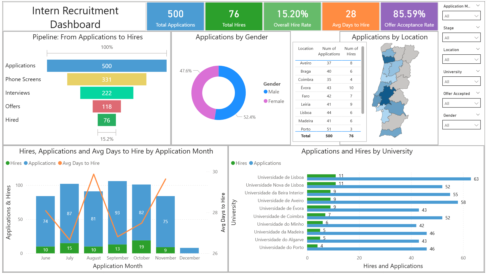

# TA Analyst Project – Intern Applications Dashboard

## About This Project
This project showcases my skills in **data analysis, SQL, and Power BI dashboard development**.  
I analyzed fictional intern application data for a company which would be hiring interns in Portugal to generate actionable insights for a recruitment team. 
It includes recruitment funnels, KPIs, and visual breakdowns by university, location, and gender.

The focus of the project is on:
- **Data preparation and cleaning** using PostgreSQL
- **Metric calculations** such as total applications, hires, offer acceptance rates, and average days to hire
- **Visual storytelling** with interactive Power BI dashboards, highlighting trends and recruitment funnels by location, university, and gender

This project demonstrates my ability to combine **technical skills** with **business understanding** to deliver meaningful insights.

## Files in the Repository
1. **`intern_applications.csv`**  
   - CSV dataset which was created with the help of ChatGPT

2. **`intern_applications_full.sql`**  
   - Contains the full SQL workflow:
     - Table creation
     - Data cleaning (fixing messy names)
     - Adding calculated columns (days to hire, application month, stage flags)
     - Queries for applications, hires, and offer acceptance metrics
   - Used to prepare and explore data

3. **`intern_applications_powerbi.sql`**  
   - Condensed query optimized for Power BI:
     - Combines multiple metrics into a single query
     - Provides data for visualizations such as applications by month, gender, location, university, and recruitment funnel stages
   - Used directly as a source in Power BI

4. **`intern_applications.pbix`**  
   - Power BI dashboard file

5. **`README.md`**  
   - This file to explain the process

---

## Technical Stack / Skills
- **Database:** PostgreSQL (data cleaning, queries, calculated fields)  
- **Data Visualization:** Power BI (DAX measures, interactive dashboards, custom maps)  
- **Data Analysis:** Metric calculations, recruitment funnels, KPI tracking  
- **Data Modeling:** Combining multiple metrics into a single, clean dataset for reporting  

---

## DAX Measures Used
These are the core DAX formulas created in Power BI to calculate key metrics:

```DAX
-- Total Applications
Total Applications = COUNTROWS('public intern_applications')

-- Total Hires
Total Hires = 
CALCULATE(
    COUNTROWS('public intern_applications'),
    'public intern_applications'[stage_hired] = TRUE
)

-- Overall Hire Rate
Overall Hire Rate (%) = 
DIVIDE(
    [Total Hires],
    [Total Applications],
    0
)

-- Total Phone Screens
Total_Phone_Screens = 
CALCULATE(
    COUNTROWS('public intern_applications'),
    'public intern_applications'[stage]IN {"Phone Screen","Interview","Offer","Hired"}
)

-- Total Interviews
Total_Interviews = 
CALCULATE(
    COUNTROWS('public intern_applications'),
    'public intern_applications'[stage]IN {"Interview","Offer","Hired"}
)

-- Total Offers
Total_Offers = 
CALCULATE(
    COUNTROWS('public intern_applications'),
    'public intern_applications'[stage]IN {"Offer","Hired"}
)

-- Offer Acceptance Percentage
Offer Acceptance Rate (%) = 
DIVIDE(
    [Offer Accepted],
    [Offer Accepted] + [Offer Rejected],
    0
);

These measures were used to power KPI cards, funnels, line/column charts, and interactive slicers.

## Project Overview
The project covers:
- Cleaning and preparing intern application data in PostgreSQL
- Calculating key metrics:
  - Total applications and hires
  - Offer acceptance rate
  - Average days to hire
- Creating stage-wise recruitment funnels (Applications → Phone Screen → Interview → Offer → Hired)
- Building interactive Power BI visuals:
  - Maps by location (Used a custom map of Portugal's Districts)
  - Recruitment funnel chart
  - KPI cards
  - Line and column charts for applications and average days to hire
  - Gender and university breakdowns

## How to Run / View
1. Load the `intern_applications.sql` script in PostgreSQL to create and prepare the dataset.
2. Open `intern_applications.pbix` in Power BI to explore the dashboard.
3. Optionally, import the CSV file `intern_applications.csv` directly into Power BI if you do not have a PostgreSQL setup.

## Key Insights / Features
- Monthly applications and hires
- Recruitment funnel showing candidate progression
- Average days to hire per month
- Interactive visuals with slicers for filtering by university, location, gender, and offer acceptance

## Dashboard Preview


## Notes
- Dataset is fictional; no sensitive data included.
- This project demonstrates SQL data preparation and Power BI dashboard building skills.


